# Noon App API
Este es el detalle de la API del _entrypoint_ al que accede la aplicación Noon cuando se realiza una búsqueda en el apartado "15" minutos.

## Carousel al inicio de la búsqueda
Esta sección de la interfaz se describe en la ruta `results[0].modules[0]` un objeto cuya clave/atributo `type` es igual a `"instantAdProductCarousel"`. Los productos allí publicados son recolectados con una segundo consulta a la API desde la dirección relativa en la clave `productUrl` (ejemplo, `"/search?f[tag]=nutri_admon_oct_24&productsOnly=1"`)

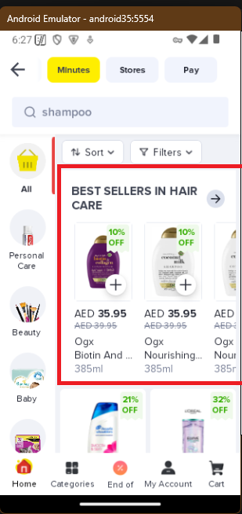

## Listado general
Esta sección contiene los artículos correspondientes a la búsqueda y son agrupados de a dos (`"numPerRow": 2`) en todos los `modules` cuyo `type` es `"instantProductBox"` bajo la clave `products` como una lista de objetos

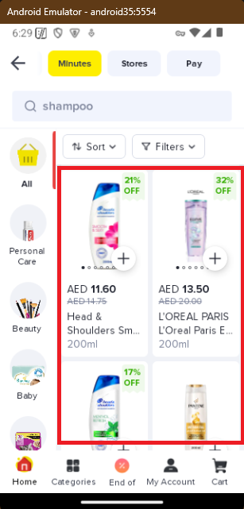

### Diccionario del producto

 -  "sku": "ZA67759DFE0A9632D9CEDZ-1",
 -  "title": "Smooth And Silky Anti-Dandruff Shampoo"
    
    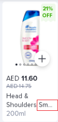
 -  "brand": "Head & Shoulders"

    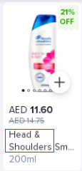
 -  "brand_code": "head_shoulders",
 -  "id_partner": 9411,
 -  "size_info": "200ml"

    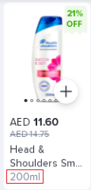
 -  "image_keys": urls relativas a las imágenes
 -  "is_buyable":
     -  true:

        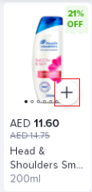
     -  false:

        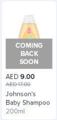
 -  "not_buyable_reason":

    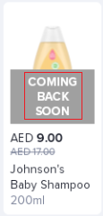
 -  "price": 14.75,
 -  "offerPrice": 11.6

    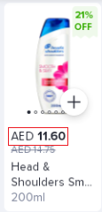
 -  "strikedPrice": 14.75

    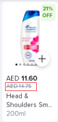
 -  "label":
     -  "type": "generic"

        "code": "new_tag"

        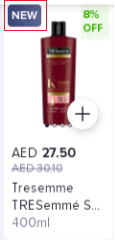
     -  "type": "combo"

        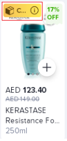        
 -  "sale_price": 11.6,
 -  "discountPercent": 21

    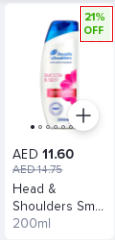
 -  "max_qty": 3,
 -  "salePriceQty": null,
 -  "isCustomizable": false,
 -  "customizationOptions": null,
 -  "exclusivePriceDetails": null,
 -  "salePriceDetails": null,
 -  "lockedProductDetails": null,
 -  "vipPriceDetails": null,
 -  "media": descripción del tipo de archivo de las imágenes
 -  "index": orden en el listado
 -  "image_key": dirección relativa de la imagen principal
 -  "icon": null,
 -  "td": 
 -  "postATCCMSenabled": true,
 -  "viewUrls": [],
 -  "clickUrls": []
 -  "sponsoredText": ""

 > La clave `sponsoredText` aparece vacía en todos los productos de todas las búsquedas realizadas. De todas formas puede ser una _feature_ que se piense implementar después 